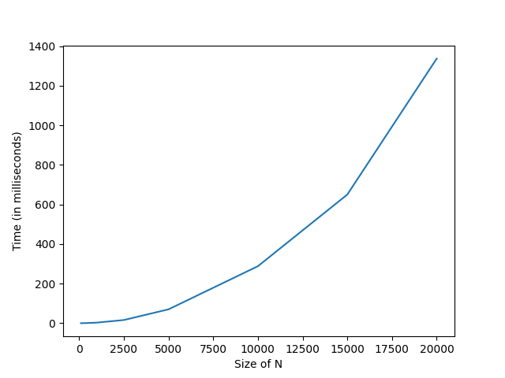
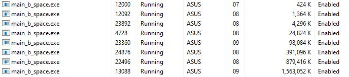
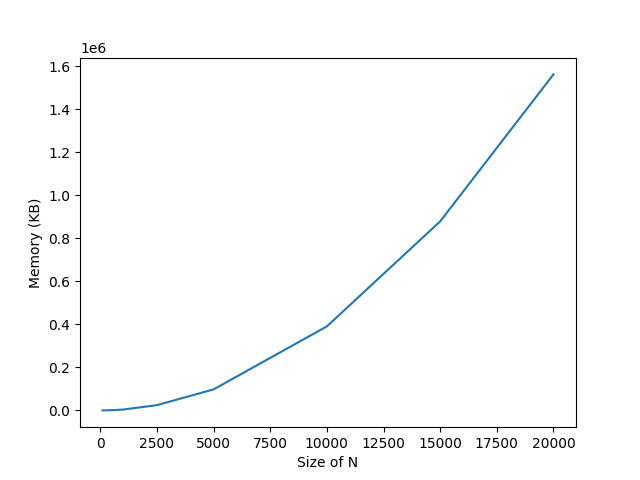

# Vector Matrix Multiplication Benchmark

Analyzing vector matrix multiplication. The operating system used for this benchmarking process is Windows OS.

## Running the Test

Command to compile the `main_test.c` file
```
gcc -o main_test.exe main_test.c utils/utils.c mylib/mylib.c
```

Command to run the program (on windows):
```
main_text.exe
```

If you run it correctly, this will be the output:
```
Test #1:
Actual V[0] = 0 ; Expected V[0] = 0 
Actual V[1] = 0 ; Expected V[1] = 0 
Actual V[2] = 0 ; Expected V[2] = 0

Test #2:
Actual V[0] = 16; Expected V[0] = 16
Actual V[1] = 27; Expected V[1] = 27
Actual V[2] = 22; Expected V[2] = 22

Test #3:
Actual V[0] = 34; Expected V[0] = 34
Actual V[1] = 27; Expected V[1] = 27
Actual V[2] = 21; Expected V[2] = 21

Test #4:
Actual V[0] = 11; Expected V[0] = 11
Actual V[1] = 9 ; Expected V[1] = 9
Actual V[2] = 12; Expected V[2] = 12
```

What the code does is just simply testing the `matVecMult()` function with some of the input matrix and vector that has been provided as the test cases then compare the result produce by that function with the expected result. If it's the same, then we can considered that the function works correctly.

## Exploring Time Complexity

Command to compile the `main_b_time.c` file
```
gcc -o main_b_time.exe main_b_time.c utils/utils.c mylib/mylib.c
```

Command to run the program (on windows):
```
main_b_time.exe <integer>
```

`<integer>` means that you can write a single integer. This single integer represents the N size of the matrix and the vector dimension.

For example, this command below will be executed:
```
main_b_time.exe 10000
```

The output will be like this
```
Function: multiply_vector_matrix, time elapsed: 352.999926 ms
```

It means that, having the size of N = 10000, the amount of time needed to compute the multiplication of N x N matrix to the N-vector is 352.999926 ms.

Here is the graph showing the the amount of time needed as the N size goes higher.



## Exploring Space Complexity

Command to compile the `main_b_space.c` file
```
gcc -o main_b_space.exe main_b_space.c utils/utils.c mylib/mylib.c
```

Command to run the program (on windows):
```
main_b_space.exe <integer>
```

`<integer>` means that you can write a single integer. This single integer represents the N size of the matrix and the vector dimension.

For example, this command below will be executed:
```
main_b_space.exe 10000
```

On task manager, there will be `main_b_space.exe` running. Please refer to this image below


Here is the image showing the the amount of space needed as the N size goes higher.



Here is the graph showing the the amount of space needed as the N size goes higher.


